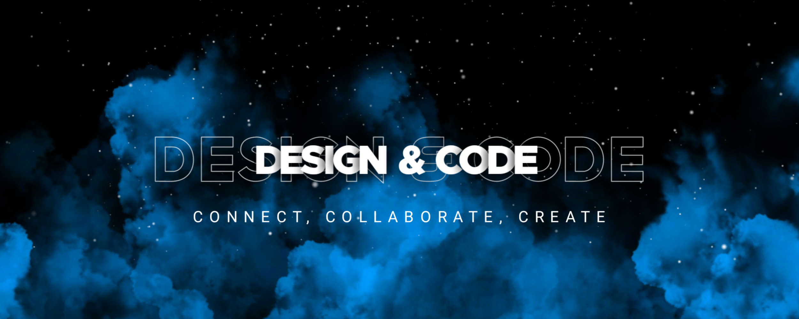

# My name is Ayush Patil 

## I am a Frontend Web Developer with a knack for design

I am a highly skilled and motivated web developer with over a year of experience in creating and maintaining web applications. My expertise lies in frontend development using the ReactJS.

- 🌍  I'm based in India
- ✉️  You can contact me at [ayushypatil.work@gmail.com](mailto:ayushypatil.work@gmail.com)
- 🧠  I'm learning NodeJS
- 🤝  I'm open to collaborating on MERN stack Projects

---

  
  

###

###

  
  
  
  
  
  
  
  
  
  
  
  
  
  
  
  
  
  
  
  
  
  
  
  
  

###

  
  
  
  

###

 

###
